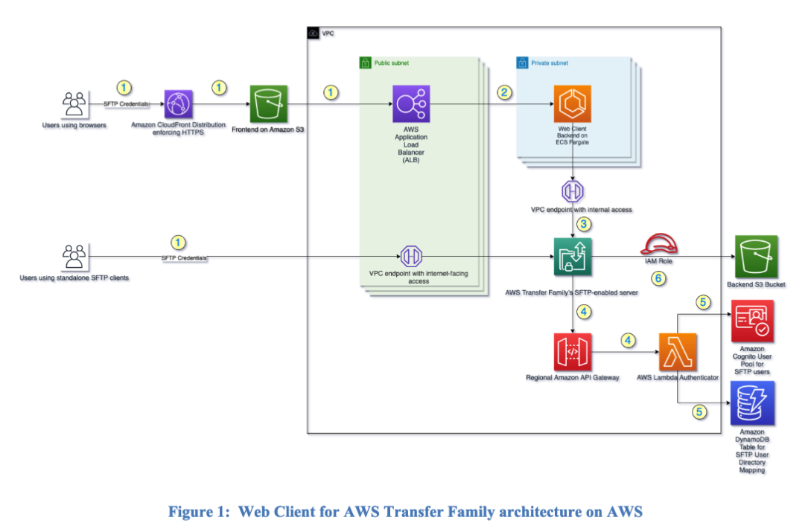
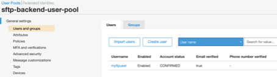
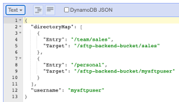
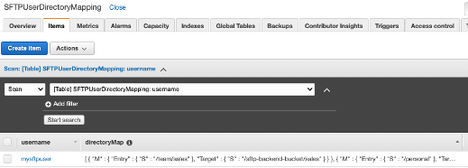
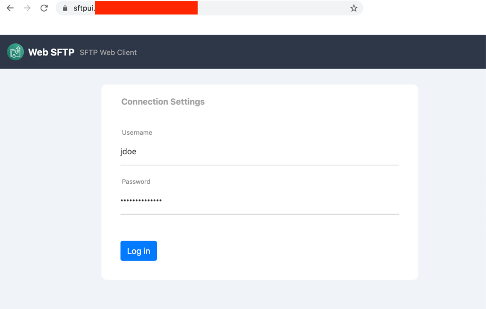
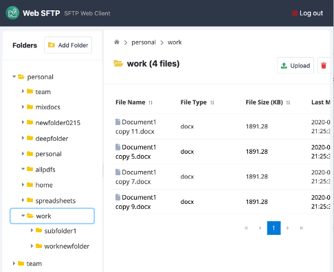

# Web Client for AWS Transfer Family
AWS customers are looking for ways to provide simple browser-based user interfaces to their corporate SFTP environments. Many of their non-technical users find it inconvenient to use thick client tools such as FileZilla and others. Moreover, many customers do not want to install and support different clients on various end user devices and operating systems. By adopting an intuitive and browser-based solution they reduce the effort of managing commercial or open-source client and having to troubleshoot different end-user devices and operating systems. 
The solution supports common file operations such as Upload, Download, Rename and Delete.

This guide provides infrastructure and configuration information for planning and deploying Web Client for AWS Transfer Family (only **SFTP-enabled server** supported with release). Web Client for AWS Transfer Family’s SFTP-enabled server provides a simple and intuitive web browser interface to AWS Transfer Family’s SFTP-enabled server service and supports common file operations such as upload, download, rename and delete.

## Architecture Overview
The solution deploys a dedicated Amazon Virtual Private Cloud (Amazon VPC) with three private and three public subnets 
spread across three availability zones.

In addition, the solution deploys a web application into an Amazon S3 bucket configured for static website hosting. 
Amazon CloudFront is used to restrict access to the solution’s website bucket contents.

The solution also deploys Elastic Container Service (Amazon ECS) containers running on AWS Fargate in the private 
subnets. The containers host a python-based application that exposes an API to front-end requests. VPC Endpoints are 
created for secure access to various services from ECS Fargate containers.

The solution deploys AWS Transfer Family’s SFTP-enabled server and uses Amazon Cognito user pool to manage user access 
to the web application as well as for custom authentication with AWS Transfer Family. Amazon DynamoDB is used to store 
logical directory path mapping for AWS Transfer Family’s SFTP-enabled server.

Deploying this solution builds the following environment in the AWS Cloud.



Following is a high-level user request flow, as depicted by numbered-arrows in above diagram:
1.	End-users can interact with the web client front-end, Angular Single Page Application SPA), 
      hosted in Amazon S3 and is fronted by Amazon CloudFront. Users provide their Amazon Cognito 
      credentials to log in. In addition, users can use other SFTP clients such as FileZilla to 
      directly interface with AWS Transfer Family SFTP-enabled endpoint using their Amazon Cognito 
      credentials.
      
2.	The user request from front-end invokes backend APIs (log in, log out, list files and 
      directories, create and delete files, rename files) running in AWS ECS Fargate.
      
3.	Fargate tasks programmatically interact with AWS Transfer Family SFTP-enabled endpoint, 
      making SFTP connection using user-provided Amazon Cognito credentials.
      
4.	Transfer Family passes these credentials to the API Gateway endpoint. The API is integrated 
      with a Lambda function. The Transfer Family server then uses the API Gateway URL backed 
      by the Lambda function to query Amazon Cognito and validate the end user’s credentials

5.	Once the user is authenticated, the AWS Lambda function queries for the user’s details (such as logical 
      mapping) from a DynamoDB table. The response from the API Gateway authorizes the end user and grants 
      access to the Amazon S3 bucket

## Supported AWS Regions

This solution is supported in following AWS regions:

* us-east-1 (Virginia)
* us-east-2 (Ohio)
* us-west-2 (Oregon)
* ap-south-1 (Mumbai)
* ap-northeast-2 (Seoul)
* ap-southeast-1 (Singapore)
* ap-southeast-2 (Sydney)
* ap-northeast-1 (Tokyo)
* ca-central-1 (Canada)
* eu-central-1 (Frankfurt)
* eu-west-1 (Ireland)
* eu-west-2 (London)
* eu-west-3 (Paris)
* eu-north-1 (Stockholm)
* me-south-1 (Bahrain)
* sa-east-1 (Sao Paulo)

## Deploying Cloudformation Templates
There are eight Cloudformation templates that are used to deploy this solution in AWS account. The templates are 
numbered in the order to be executed.

## AWS CloudFormation Templates

This solution uses AWS CloudFormation to automate the deployment of the Web Client for AWS Transfer Family in the 
AWS Cloud. It includes the following CloudFormation templates, which you can download before deployment:

`01-sftp-vpc.template`: Use this template to launch Amazon VPC spanning 3 AZs. The default configuration deploys 
the required VPC and other best practices related resources such as security groups and VPC endpoints. You can 
customize the template based on your specific needs.

`02-sftp-cognito.template`: Use this template to create Amazon Cognito User Pool and User Pool Client. The default 
configuration deploys a Cognito user pool for provisioning users. You can customize the template based on your 
specific needs.

`03-sftp-endpoint.template`: Use this template to create AWS Transfer Family SFTP-enabled server, Amazon API Gateway 
and Lambda function for custom authentication, AWS DynamoDB table for AWS Transfer user mapping and AWS Backup 
resources. The default configuration deploys and AWS Transfer Family SFTP-enabled server along with the required 
resources to support a working endpoint according to best practices. You can customize the template based on your 
specific needs.

`04-sftp-ecs.template`: Use this template to create the Amazon ECS infrastructure to host the containerized backend 
application. The default configuration creates an ECS cluster and related resources such as Amazon ECR container 
registry to support the backend application. You can customize the template based on your specific needs.

`05-sftp-fargate.template`: Use this template to launch the AWS Fargate service representing the backend application. 
The default configuration deploys AWS ECS Service, AWS Systems Manager Parameters, AWS S3 buckets and AWS ECS Task 
definition, but you can also customize the template based on your specific needs.

`06b-security-headers-lambda-edge.template`: Use this template to implement security headers using Lambda@Edge.

`07-sftp-web-client.template`: Use this template to configure the user interface for the Web Client Solution. 
This stack creates the required AWS S3 buckets and AWS CloudFront distribution to host a static website deployment
on S3 fronted by CloudFront. You can customize the template based on your specific needs.

`08-operational-metrics.template`: Use this template to configure to collect and send operational metrics of the deployment of this solution.

## Automated Deployment
Before you launch the automated deployment, please review the architecture, configuration, network security, 
and other considerations discussed in this guide. Follow the step-by-step instructions in this section to configure 
and deploy Web Client for AWS Transfer Family into your account.

**Time to deploy: Approximately 50-60 mins**

## Prerequisites

-	The solution assumes that you already have a **S3 bucket** with **folder/prefix** paths defined, which will be used as 
     the **data bucket** for **AWS Transfer Family’s SFTP-enabled server**.
     
-	The solution assumes you have an existing **ACM certificate** to protect endpoints with your organizations own SSL 
     certificate. The **ARN** for this certificate will be needed when deploying **05-sftp-fargate.template** CloudFormation 
     template below.
     
-	The solution assumes you have a **Route 53 Hosted Zone** representing the **domain** for the solutions endpoints. This 
     solution will add a record set specific to your sftp endpoints.
     
-	Docker client is installed on your local machine to build the application's container image.

-	NodeJS/Angular development environment configured on your local machine to build the solutions web-based user 
     interface.
     - First, we must install NodeJS/NPM. 
     >**NOTE: we are using NodeJS 14.15 along with Angular 12 and related libraries.**
     - Install Node Version Manager: 
       ```shell
       curl -o- https://raw.githubusercontent.com/nvm-sh/nvm/v0.34.0/install.sh | bash`
       . ~/.nvm/nvm.sh
       ```
     - Install NodeJS version 14.15: 
     ```shell
     nvm install 14.15
     ```
     - Make this version the default: 
     ```shell
     nvm alias default v14.15
     ```
     - Install Angular CLI: 
     ```shell
     npm install -g @angular/cli@12
     ```

## Step 1. Pre-Launch Tasks

In this document, we will use Amazon Linux Workspace as the workstation to deploy cloud formation templates. This will 
provide a clean environment to install our dev dependencies without impact to other artifacts already installed on a 
desktop environment.

1.	Clone project code repository to your local workstation, from the GitHub location.
`git clone https://github.com/awslabs/web-client-for-aws-transfer-family -b open-source`

2. Install Docker
```shell
sudo yum install docker
sudo systemctl start docker
sudo systemctl enable docker
sudo systemctl status docker
```
3.	If you run docker build command, you may see DNS issues ‘Failed to establish a new connection: [Errno -3] Temporary 
      failure in name resolution”. To mitigate it proactively, modify docker daemon file proactively:

```shell
sudo vi /etc/docker/daemon.json
# and add following content:
{
  "dns": ["8.8.8.8", "8.8.4.4"]
}

# restart the docker service
sudo service docker restart
```

4.	Run following script from **deployment** folder. It will create **dist** folder under the root of the solution folder.

```shell
./build-dist.sh solutions web-client-for-aws-transfer-family v1.0.0
```

At this point, you are ready to deploy the solution.

## Step 2. Launch the Stacks

This solution is deployed using several CloudFormation templates representing different layers of the overall solution
stack. Please make sure that you’ve **reviewed the Prerequisites section of this document** before starting the 
installation process.

> It is also worth noting that some CloudFormation templates reference resources from parent CloudFormation templates 
using the stack names to cross-reference resources, e.g., the sftp-endpoint-stack references sftp-vpc-stack to 
determine what subnets to use. The default values for these parent stacks are already included in the relevant 
CloudFormation templates. If you decide to change the stack names to something other than the instructed stack name, 
make sure to change the default values of child stacks to your new stack names.


> Note:  You are responsible for the cost of the AWS services used while running this solution. 
> For full details, see the pricing webpage for each AWS service you will be using in this 
> solution.
>


### VPC Deployment
1.	Log in to the AWS Management Console and navigate to CloudFormation console to deploy the solution’s VPC resources. 
      Use region selector in the console navigation bar to deploy the template in solution’s supported AWS Regions. 
      Ensure to use same AWS region for remaining steps of the deployment process.
      
2.	On the stacks page, select Create stack `With new resources (standard) option`. Under Prepare template, select 
      Template is ready. Under Specify template, select Upload a template file option. Use file uploader to upload 
      `01-sftp-vpc.template` from your local clone of the project under `dist/deployment` folder. Choose Next.
      
3.	On the Specify stack details page, assign a name to your solution stack. For example, `“sftp-vpc-stack”`
      
4.	Under Parameters, review the parameters for the template and modify them as necessary. This solution uses the 
      following default values.

| Parameter	         | Default	      | Description
| -----------        | -----------    | ----------- |
| PrivateSubnet1CIDR | 10.194.2.0/24  | The CIDR range for one of the private subnets
| PrivateSubnet3CIDR | 10.194.6.0/24  |	The CIDR range for one of the private subnets
| PublicSubnet1CIDR  | 10.194.1.0/24  |	The CIDR range for one of the public subnets
| PublicSubnet2CIDR	 | 10.194.3.0/24  |	The CIDR range for one of the public subnets
| PublicSubnet3CIDR	 | 10.194.5.0/24  |	The CIDR range for one of the public subnets
| ResourceTag	     | SFTPVPC	      | Value to uniquely identify resources for this stack.
| VpcCIDR	         | 10.194.0.0/21  | The VPC CIDR Range.

5.	Choose Next.
6.	On the Configure stack options page choose `Next`,
7.	On the Review page, review and confirm the settings. Be sure to check the box acknowledging that the template will 
      create AWS Identity and Access Management (IAM) resources.
8.	Choose `Create stack` to deploy the stack.
      You can view the status of the stack in the AWS CloudFormation Console in the Status column. You should see a 
      status of `CREATE_COMPLETE` in approximately four minutes.
9.	Note down the following values from value from the Outputs section of the deployed stack.
      
   **DefaultSecurityGroup** and
   **EndpointsSecurityGroup**

### Cognito Deployment
1.	Log in to the AWS Management Console and navigate to CloudFormation console to deploy the solution’s Cognito 
      resources.
2.	On the stacks page, select Create stack `With new resources (standard) option`. Under Prepare template, select 
      Template is ready. Under Specify template, select Upload a template file option. Use file uploader to upload 
      `02-sftp-cognito.template` from your local clone of the project under `dist/deployment` folder. Choose Next.
3.	On the `Specify stack details` page, assign a name to your solution stack. For example, `“sftp-cognito-stack”`. 
      Choose Next.
4.	Under Parameters, review the parameters for the template and modify them as necessary. This solution uses the 
      following default values.


| Parameter	       | Default	    |Description
| -----------      | -----------    | ----------- |
| VPCResourceStack | sftp-vpc-stack	| Cross stack reference of the stack used to deploy the VPC resources. Use the name of the stack from VPC deployment section, step 3.


5.	Choose Next.
6.	On the Configure stack options page choose Next,
7.	On the Review page, review and confirm the settings.
8.	Choose `Create stack` to deploy the stack.
      You can view the status of the stack in the AWS CloudFormation Console in the Status column. You should see a 
      status of `CREATE_COMPLETE` in approximately less than one minute.
9.	Note down the values of following fields/keys from the Outputs section of the deployed stack. 
      
   **UserPoolClientId** and 
   **UserPoolId**


### SFTP Endpoint Deployment
1.	Log in to the AWS Management Console and navigate to CloudFormation console to deploy the solution’s SFTP Endpoint.
2.	On the stacks page, select Create stack `With new resources (standard) option`. Under Prepare template, select 
      Template is ready. Under Specify template, select Upload a template file option.  Use file uploader to upload 
      `03-sftp-endpoint.template` from your local clone of the project under `dist/deployment` folder. Choose Next.
3.	On the Specify stack details page, assign a name to your solution stack. For example, `“sftp-endpoint-stack”`
4.	Under Parameters, review the parameters for the template and modify them as necessary. This solution uses the 
      following default values.

| Parameter	                | Default	         |Description
| -----------               | -----------        | ----------- |
|AWSTransferForSFTPS3Bucket	| No default	     | Name of the S3 bucket that will be used as backend for AWS Transfer endpoint. Note: it is assumed that this bucket exists, i.e. it is not created as part of this stack.
|AWSTransferVPCSecGroup     | No default         | Please pick the default security group created as part of the 01-sftp-vpc.template stack. Use the value of  DefaultSecurityGroup from VPC Deployment Outputs in step 9.
|CognitoResourceStack       | sftp-cognito-stack | Cross stack reference of the stack used to deploy the Cognito resources (02-sftp-cognito.template). Use the name of the stack from Cognito deployment section, step 3.
|VPCResourceStack           | sftp-vpc-stack	 | Cross stack reference of the stack used to deploy the VPC resources. Use the name of the stack from VPC deployment section, step 3.

5.	Choose Next.
6.	On the Configure stack options page choose Next.
7.	On the Review page, review and confirm the settings. Be sure to check the box acknowledging that the template will 
      create AWS Identity and Access Management (IAM) resources
8.	Choose `Create stack` to deploy the stack.
      You can view the status of the stack in the AWS CloudFormation Console in the Status column. You should see a 
      status of `CREATE_COMPLETE` in approximately 11-12 minutes.

### ECS Cluster Deployment
1.	Log in to the AWS Management Console and navigate to CloudFormation console to deploy the solution’s ECS Cluster 
      that will host our Fargate Tasks.
2.	On the stacks page, select Create stack `With new resources (standard) option`. Under Prepare template, select 
      Template is ready. Under Specify template, select Upload a template file option. Use file uploader to upload 
      `04-sftp-ecs.template` from your local clone of the project under `dist/deployment` folder. Choose Next.
3.	On the Specify stack details page, assign a name to your solution stack. For example, `“sftp-ecs-stack”`
4.	Under Parameters, review the parameters for the template and modify them as necessary. This solution uses the 
      following default values.

| Parameter	         | Default	                   |Description
| -----------        | -----------                 | ----------- |
| HostedZoneId       | No default	               | The ID of the Route 53 hosted zone you wish to add a RecordSet pointing to your backend API URL, i.e. the ALB fronting the backend API.
| RecordName         | sftpapi.mycompanydomain.com | The DNS name for a new record set. For example, if the hosted zone is mycompanydomain.com' then the entry should be '<RecordName>.mycompanydomain.com'). This record set will point to the Application Load Balancer fronting the backend API on ECS.
| VPCResourceStack   | sftp-vpc-stack	           | Cross stack reference of the stack used to deploy the VPC resources. Use the name of the stack from VPC deployment section, step 3.

5.	Choose Next.
6.	On the Configure stack options page choose Next,
7.	On the Review page, review and confirm the settings. Be sure to check the box acknowledging that the template will 
      create AWS Identity and Access Management (IAM) resources
8.	Choose Create stack to deploy the stack.
      You can view the status of the stack in the AWS CloudFormation Console in the Status column. You should see a 
      status of CREATE_COMPLETE in approximately 3 minutes.
9.	Note down the value of following field/key from the Outputs section of the deployed stack. 

    **ECR**

### Creating our applications Docker image
At this point we will build our container image representing the backend application that is our SFTP API. We then 
deploy this image to ECS.

>NOTE: To execute the following instructions the script requires that you pass an AWS_PROFILE with sufficient privileges 
to execute the scripted API commands.

1.	From your local clone of the project under `dist/deployment` folder, select `04a-build-docker-image.sh` file and modify 
      it as follows:
      
      Line 10: Set `COMPANY_DOMAIN` variable to your corporate domain, e.g. mycompanydomain.com
      
      Line 11: Set `CLOUDFRONT_CNAME` variable to the CNAME for your CloudFront distribution, e.g. ui.mycompanydomain.com
      
      Line 12: Set `ECR_REPO_NAME` variable to the value of `ECR` key from step 9 of previous section, e.g. 
      sftp-backend-0a635743

2.	Execute the script as follows: 

```shell
./04a-build-docker-image.sh <AWS_PROFILE>
```

> Note: You may need to adjust the permission on the file using chmod command to make it an executable.

> Note: You may need to execute above command using sudo if you see any permission issues.

3.	In the AWS ECR console, navigate to the `sftp-backend-<>` repository created in last section and copy the Image 
      URI, e.g. `XXXXYYYYZZZZ.dkr.ecr.us-west-2.amazonaws.com/sftp-backend:latest`

### Fargate Task Deployment

1.	Log in to the AWS Management Console and navigate to CloudFormation console to deploy the solution’s Fargate Tasks 
      to the already Created ECS Cluster.
2.	On the stacks page, select Create stack `With new resources (standard) option`. Under Prepare template, select 
      Template is ready. Under Specify template, select Upload a template file option. Use file uploader to upload 
      `05-sftp-fargate.template` from your local clone of the project under `dist/deployment` folder. Choose `Next`.
3.	On the Specify stack details page, assign a name to your solution stack. For example, `“sftp-fargate-stack”`
4.	Under Parameters, review the parameters for the template and modify them as necessary. This solution uses the 
      following default values.

| Parameter	           | Default	              |Description
| -----------          | -----------          | ----------- |
|ACMCertificateARN     | No default	          | The ARN of the ACM certificate used for HTTPS ALB endpoint. NOTE: Use ARN of certificate defined within the region the ALB resides.
|ContainerCPU          | 256                  | Amount of CPU for each task; 1024 = 1 vCPU. See supported CPU and memory values for Fargate tasks here.
|ContainerMemory	   | 512	              | Memory in GB for each task.
|ContainerPort	       | 80	                  | The Container port.
|TaskCount	           | 3	                  | Number of Fargate tasks to deploy.
|ECSStackName	       | sftp-ecs-stack	      | Cross stack reference of the stack used to deploy the ECS resources. Use the name of the stack from ECS Cluster deployment section, step 3.
|ImageURI	           | No Default           | The ECR Image URI for the application.
|SFTPEndPointStackName | sftp-endpoint-stack  | Cross stack reference of the stack used to deploy the SFTP resources. Use the name of the stack from SFTP Endpoint deployment section, step 3.
|VPCResourceStack	   | sftp-vpc-stack	      | Cross stack reference of the stack used to deploy the VPC resources. Use the name of the stack from VPC deployment section, step 3.

5.	Choose Next.
6.	On the Configure stack options page choose Next,
7.	On the Review page, review and confirm the settings. Be sure to check the box acknowledging that the template will 
      create AWS Identity and Access Management (IAM) resources
8.	Choose Create stack to deploy the stack.
      You can view the status of the stack in the AWS CloudFormation Console in the Status column. You should see a 
      status of `CREATE_COMPLETE` in approximately 1 minute.
      Note down the following value from the Outputs section of the deployed stack, which will be used in the next step:

    **SFTPWebClientBucket**


### Web Client Infrastructure Setup

We now need to deploy and configure Lambda@Edge function that will insert necessary security headers 
(Strict-Transport-Security, X-Frame-Options, X-XSS-Protection, X-Content-Type-Options, Content-Security-Policy) which 
will be used by the cloudfront distribution.

> NOTE: to execute the following instructions the script requires that you pass an AWS_PROFILE with sufficient 
> privileges to execute the scripted API commands.
> 
1. Under the `dist/deployment` folder, edit `06a-add-security-header.sh` as follows. 
   
   a. The value for `DOMAIN_NAME` should be set to your company’s domain. e.g. .mycompanydomain.com

Execute the script as follows:
```shell
./ 06a-add-security-header.sh <AWS_PROFILE>
```

> Note: You may need to adjust the permission on the file using chmod command to make it an executable.

Note down the value of `OutputValue` which is the Lambda@Edge function’s version ARN. That will be used in next section.

1.	Log in to the AWS Management Console and navigate to CloudFormation console to deploy the solution’s Web Client 
      resources.
>
> Note: If you are deploying in Cape Town (af-south-1), Hong Kong (ap-east-1), Milan (eu-south-1), or Bahrain (me-south-1) modify `07-sftp-web-client.template` under `dist/deployment` folder, comment three lines (147-149),and save the template before following next step.
>

2.	On the stacks page, select Create stack `With new resources (standard) option`. Under Prepare template, select 
      Template is ready. Under Specify template, select Upload a template file option.  Use file uploader to upload 
      `07-sftp-web-client.template` from your local clone of the project under `dist/deployment` folder. Choose Next.
3.	On the Specify stack details page, assign a name to your solution stack. For example, `“sftp-webclient-stack”`
4.	Under Parameters, review the parameters for the template and modify them as necessary. This solution uses the 
      following default values.

| Parameter	                  | Default	                    |Description
| -----------                 | -----------                 | ----------- |
|ACMCertificateARN            | arn:aws:acm:us-east-1:111222333444:certificate/99988822-5a2b-4e8e-aaf0-83d8deed4445	| The ARN of the ACM certificate used for CloudFront. **<span style="color:red">NOTE: This certificate, unlike the certificate used for the ALB in the Fargate task deployment, must reside in us-east-1 regardless of what region you choose for your solution deployment.</span>**
|CNameAlternateDomainName     | ui.mycompanydomain.com	    | CloudFront distribution alternate domain name that matches R53 domain name for your user interface.
|LambdaEdgeVersionARN         | No default	                | ARN of Lambda@Edge function's version ARN to be used in CF distribution. Use value you noted for OutputValue above.
|HostedZoneId                 | No Default                  | The ID of the Route 53 hosted zone you wish to add a RecordSet pointing to your CloudFront distribution URL, i.e. the distribution serving your user interface.
|FargateResourceStack         | sftp-vpc-stack	            | Cross stack reference of the stack used to deploy the VPC resources. Use the name of the stack from VPC deployment section, step 3.
|VPCResourceStack	          | sftp-fargate-stack          | Cross stack reference of the stack used to deploy the VPC resources. Use the name of the stack from Fargate deployment section, step 3.

6.	On the `Configure stack options` page choose Next,
7.	On the `Review` page, review and confirm the settings. Be sure to check the box acknowledging that the template will 
      create AWS Identity and Access Management (IAM) resources
8.	Choose `Create stack` to deploy the stack.
      
You can view the status of the stack in the AWS CloudFormation Console in the Status column. You should see a 
status of `CREATE_COMPLETE` in approximately 5 minutes.

### Web Client Deployment
We now need to compile our Web UI project and deploy the compiled assets to the S3 bucket designated to host our static
website. In the prior deployment step, we set up a CloudFront distribution that points to this S3 bucket as the origin 
for our user interface.
> NOTE: to execute the following instructions the script requires that you pass an AWS_PROFILE with sufficient 
> privileges to execute the scripted API commands.

Under the `dist/deployment` folder, edit `07a-sftp-web-assets-to-s3.sh` as follows. You will need to update the environment variables `BACKEND_URL` and `SFTP_WEB_CLIENT_BUCKET`

- The value for `BACKEND_URL` should be updated to reflect the Route 53 RecordSet pointing to your ALB (see ECS Cluster Deployment section of the guide, Step 4, input parameter RecordName). Please preserve the formatting as noted in the file, e.g. `https:\/\/sftpapi.mycompanydomain.com`
      
- The value for `SFTP_WEB_CLIENT_BUCKET` should be updated with the name of the bucket created in the step ‘Fargate Task Deployment. You can get the name of this bucket by looking at the output section of the stack for the following key: ‘SFTPWebClientBucket’
        
Execute the script as follows: 
```shell
./07a-sftp-web-assets-to-s3.sh <AWS_PROFILE>
```
        
>Note: You may need to adjust the permission on the file using chmod command.
        
        
When completed you should see the compiled assets in the S3 bucket
      
      
## Step 3. Adding and mapping users

### Adding a Cognito test user
1.	Adding a Cognito test user by editing `07b-cognito-seed.sh` under the `dist/deployment` folder and updating the following

| Parameter	                  |Description
| -----------                 | ----------- |
|COGNITO_CLIENT_ID 	          | Get from sftp-cognito-stack outputs UserPoolClientId
|COGNITO_APP_CLIENT_SECRET 	  | See Cognito Deployment section for details on getting this value.
|COGNITO_USER_USERNAME        | Desired username
|COGNITO_USER_PASSWD	      | Enter a password consisting upper case, lower case, number, and special character, e.g. ‘TempPass@123456'
|COGNITO_USER_TELNUM	      | example: '+12158348813'
|COGNITO_USER_EMAIL_DOMAIN	  | example: 'amazon.com'
|COGNITO_USERPOOL_ID	      | Get from sftp-cognito-stack outputs UserPoolId

2.	Under `dist/deployment`, run the following script by executing as follows. When script completes you can check for the existence of this user in your Cognito User Pool.
```shell
./07b-cognito-seed.sh <AWS_PROFILE>
```

        

### Configuring DynamoDB table

In this section you configure the mapping of a Cognito user we created above, to S3 bucket folder. Recall that an S3 
bucket is designated as the backend bucket for SFTP. This bucket will contain a folder for each user.  In this example, 
user `mysftpuser` is mapped to backend bucket is sftp-backend-bucket and thus will map a folder from our designated 
bucket to this username. Here is the entry you must add to `SFTPUserDirectoryMapping` DynamoDB, creating by the 
CloudFormation templates in prior sections.

  


```json
{
      "directoryMap": [
            {
                  "Entry": "/team/sales",
                  "Target": "/sftp-backend-bucket-eu-west-1/sales"
            },
            {
                  "Entry": "/personal",
                  "Target": "/sftp-backend-bucket-eu-west-1/jdoe"
            }
      ],
      "username": "jdoe"
}
```

### Logging in and testing
Open a browser and navigate to CloudFront distribution alternate domain name you set previously. It  will load the 
UI, as shown below.



Upon logging in, user will see following layout:



### (Optional) Operational Metrics
Under the `dist/deployment` folder, you can run `08-operational-metrics.template` to help us gather operational metrics for this solution.

1.	Log in to the AWS Management Console and navigate to CloudFormation console.
2.	On the stacks page, select Create stack `With new resources (standard) option`. Under Prepare template, select 
      Template is ready. Under Specify template, select Upload a template file option. Use file uploader to upload 
      `08-operational-metrics.template` from your local clone of the project under `dist/deployment` folder. Choose Next.
3.	On the Specify stack details page, assign a name to your solution stack. For example, `“sftp-operational-metrics-stack”`
4.	Under Parameters, review the parameters for the template and modify them as necessary. This solution uses the 
      following default values.

| Parameter	         | Default	                   |Description
| -----------        | -----------                 | ----------- |
| CognitoStackName   | sftp-cognito-stack	       | The name of the parent Cognito stack that you created. Necessary to locate and reference resources created by that stack
| ECSStackName       | sftp-ecs-stack              | The name of the parent ECS Fargate networking stack that you created. Necessary to locate and reference resources created by that stack.
| SendAnonymousUsage | Yes          	           | Send operational metrics of this solution anonymously.
| VPCResourceStack   | sftp-vpc-stack	           | Cross stack reference of the stack used to deploy the VPC resources. Use the name of the stack from VPC deployment section, step 3.

5.	Choose Next.
6.	On the Configure stack options page choose Next,
7.	On the Review page, review and confirm the settings. Be sure to check the box acknowledging that the template will 
      create AWS Identity and Access Management (IAM) resources
8.	Choose Create stack to deploy the stack.
      You can view the status of the stack in the AWS CloudFormation Console in the Status column. You should see a 
      status of CREATE_COMPLETE in approximately 5 minutes.

### Customize UI icon and text
You can change the icon and text that appears on the top left in the UI by modifying `dist/source/frontend/src/assets/images/logo.png` file from your local clone, before deployment.
You can change the text that appears on the top left in the UI by modifying `dist/source/frontend/src/assets/config/config.json` file from your local clone, before deployment.

### Supported File and Folder Operations
The solution supports following file and folder operations:

*	List – Both file and folder
*	Upload – File only. Only single file at a time can be uploaded. Drag and drop of file supported as well.
*	Download – File only. Only single file at a time can be downloaded.
*	Rename – File only.
*	Delete – File and folder. While deleting a folder, it should be empty. 
*	Create – Folder only.

###Uploading and Downloading large files
The Gunicorn connection timeout is set to 600 seconds for sync workers. In order to upload and download files of large sizes, you can adjust the timeout value to be set at higher interval. This could be done by modifying the Dockerfile (from your local clone of the project under `dist/source/backend/Dockerfile` path), line#43:

````
ENTRYPOINT gunicorn --bind 0.0.0.0:80 transfer_sftp_backend:app --timeout 600
````

### Monitoring and Logging
The cloud logs are available under `/ecs/sftp-ecs-logs` log group. The logging convention is as follows:

Class | LogLevel | FargateTaskID(GunicornProcessID) – OperationName - Messsage

You can adjust the log level by changing the configuration in `dist/source/backend/logging.conf` file. 
In addition, you can enable Container Insights on your ECS Fargate cluster by following the steps outlined here. This will give you performance insights (CPU, Memory, Network, Storage) into your Fargate tasks.
The Upload and Download operations make use of Fargate Task’s ephemeral storage. The solution also deploys a custom ECS CloudWatch metric Fargate Task Ephemeral Storage which shows the amount of ephemeral storage remaining for a given Fargate Task.

### Un-install Guidelines

1.	Ensure following S3 buckets are empty.
	1. cloudfront-logs-<stackID>
	2. sftp-web-ui-artifacts-<stackID>
	3. sftp-web-ui-access-logs-<stackID>
2.	Delete sftp-webclient-stack.
3.	Delete sftp-fargate-stack
4.	Ensure sftp-backend ECR repository in the region of deployment is deleted.
5.	Ensure Delete Protection is disabled on the Public load balancer.
6.	Delete sftp-ecs-stack.
7.	Delete all recovery points, if any, under AWS Backup -> Backup vaults -> BackupVaultWithDailyBackups-<stackId>. 
8.	Delete backup vault under AWS Backup -> Backup vaults -> DynamoDBBackupVaultWithDailyBackups-<stackID>
9.	Delete sftp-endpoint-stack 
10.	Delete sftp-cognito-stack
11.	Delete sftp-vpc-stack


***


Copyright 2019 Amazon.com, Inc. or its affiliates. All Rights Reserved.

Licensed under the Apache License Version 2.0 (the "License"). You may not use this file except in compliance with the 
License. A copy of the License is located at

    http://www.apache.org/licenses/

or in the "license" file accompanying this file. This file is distributed on an "AS IS" BASIS, WITHOUT WARRANTIES OR 
CONDITIONS OF ANY KIND, express or implied. See the License for the specific language governing permissions and 
limitations under the License.
